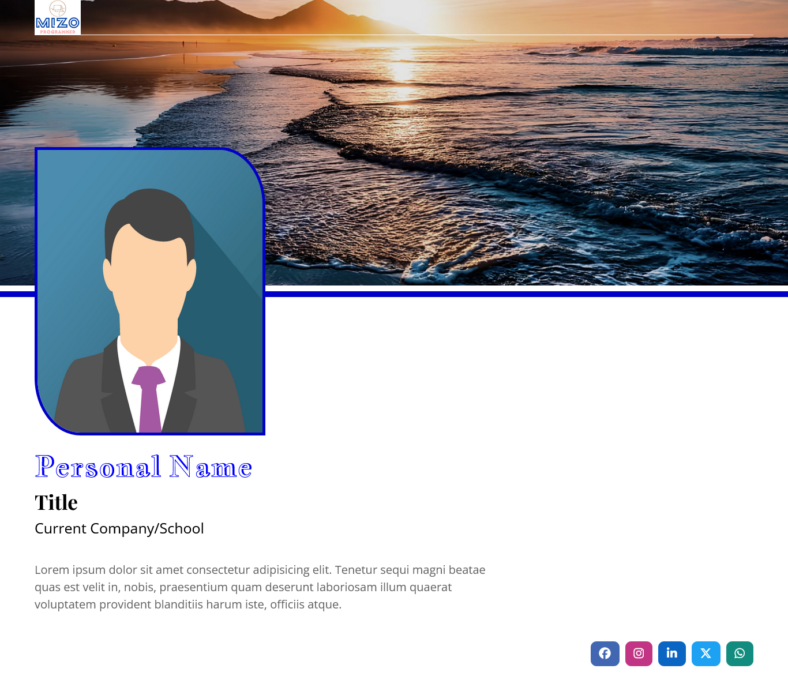

<h1>Blog Website</h1>

  

<h2>Description</h2>

  This is a Blog website made by 
  <em>HTML</em> , 
  <em>CSS</em> and
  <em>JavaScript</em> languages.
  Inspired by 
  <strong>
    <a href="https://www.udacity.com/">UDACITY</a>
  </strong>
  .

My goal from this project is to show my experience in Front-end web development.

<h3><u>Functionality buttons:</u></h3>
<ul>
  <li>Navbar links to go throw sections.</li>
  <li>Arrow down to go to first section.</li>
  <li>Post section's link to go to post page.</li>
</ul>

- Other buttons and links just for design.

<h3><u>Animations:</u></h3>
<ul>
  <li>Hover on buttons and links.</li>
  <li>Hover on Blog section's images to show its content.</li>
  <li>On scroll change colors and rotation of section's title.</li>
</ul>

<h3><u>Responsiveness:</u></h3>

  The website is responsive, it created to use across all devices, such as modern desktops, tablets, and phone browsers.

>Please note that all images, videos and contents in this project are random and just
to show the design and the functionality of the website.

<h2>Screenshots</h2>
<h3><u>Blog Page:</u></h3>

>Back-ground images are fixed, so it will be repeated in the screenshot.

<h3><u>Post Page:</u></h3>
